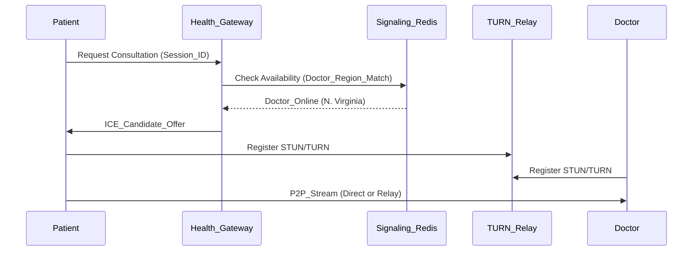

# 🏥 Module 2: The Integrated Social & Health Mesh

> **Execution Level:** HIGH-DEPTH (Buildable)  
> **Target Regions:** US (HIPAA), EU (GDPR), IN (DPDP)

---

## 🏗️ 1. The "Air-Gapped" Health Vault
The **Health Vault** is a physically isolated SQL database instance (EC2 + EBS Encrypted) with No Public Access.

### 1.1. Physical Isolation Strategy
- **Health-API**: Resides in a `private-subnet`.
- **Social-API**: Resides in a `restricted-subnet`.
- **Connectivity**: Managed via **VPC Peering** or **PrivateLink** for Zero-Trust communication.

---

## 🔐 2. Zero-Knowledge Milestone Sharing
A user wants to share "My Heart Rate was 140 BPM" (Health) to their "Social Feed" without the Social Database ever seeing the raw PHI record.

### 2.1. The "Scoped Token" Mechanism (SST)
1. **User Action**: Clicks "Share to Feed" on a Health record.
2. **Health Service Action**: 
   - Generates a **One-Time Milestone JWT (OMJ)**.
   - Signs it with the `Health-Private-Key`.
3. **Payload of OMJ**:
```json
{
  "iss": "genesis-health-svc",
  "sub": "user_123",
  "aud": "genesis-social-svc",
  "exp": 123456789,
  "milestone": {
    "type": "WORKOUT_COMPLETE",
    "summary": "5 Miles Ran in 40 mins",
    "verified_by": "Genesis-Core-V1"
  },
  "raw_phi_ref": "None", # Crucial: Omits the actual record ID
  "jti": "nonce_987"
}
```
4. **Social Service Action**: 
   - Recieves the OMJ via `POST /api/social/posts/milestone`.
   - Verifies the JWT signature using the `Health-Public-Key`.
   - Stores the `summary` and `verified_by` in the Social Database.

---

## 📡 3. Telemedicine Engine: WebRTC Signal Flow
High-performance video consultation with low-latency regional fallbacks.

### 3.1. Session Signaling Architecture


---

## ⚕️ 4. FHIR-Compliant EHR Integration
All health data is stored in **HL7 FHIR R4** format to enable easy portability for US/EU hospital systems.

### 4.1. Observation Schema (Simplified JSONB)
```sql
CREATE TABLE health_observations (
    observation_id UUID PRIMARY KEY,
    patient_id UUID REFERENCES global_users(user_id),
    category STRING, -- 'vital-signs', 'laboratory'
    phi_blob JSONB, -- Encrypted AES-256-GCM
    hash_key STRING, -- HMAC of raw data for integrity check
    region ENUM('US', 'EU', 'IN')
) REGIONAL BY ROW;
```

---

## 🏗️ 5. Next Level: Build Call
**Instruction to LLM:** "Write the Python script for the 'Health Vault' encryption layer using `cryptography.hazmat.primitives.ciphers.aead`. Implement the 'Scoped Token' generator and the public-key rotation logic for cross-service verification."
