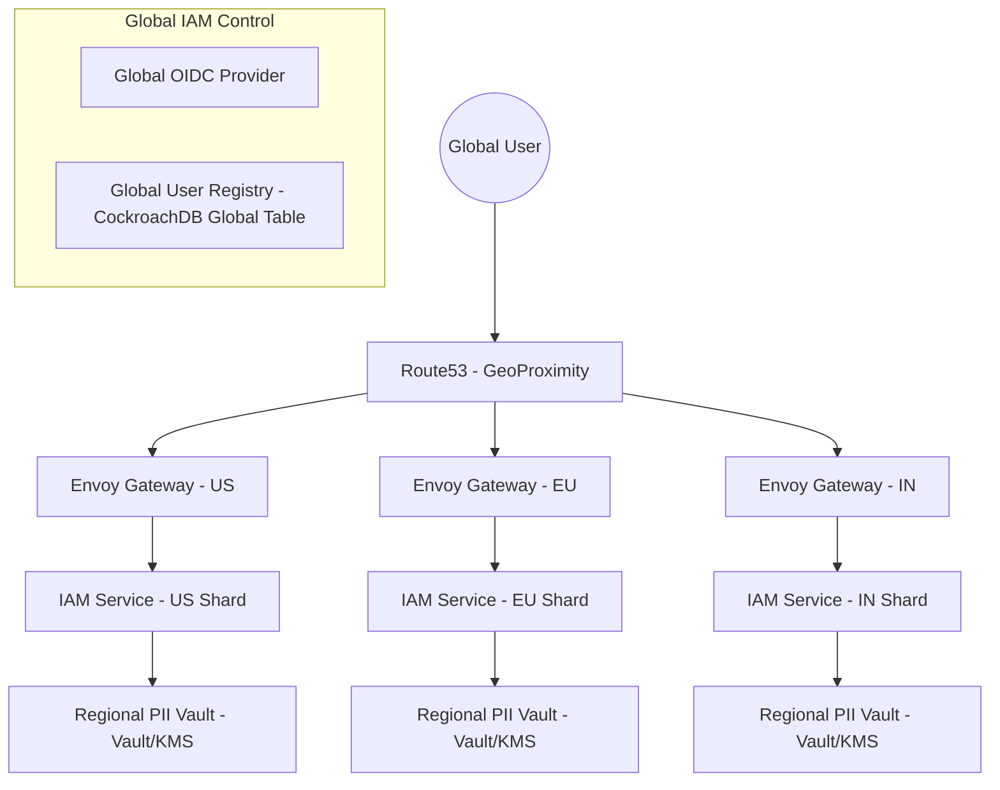
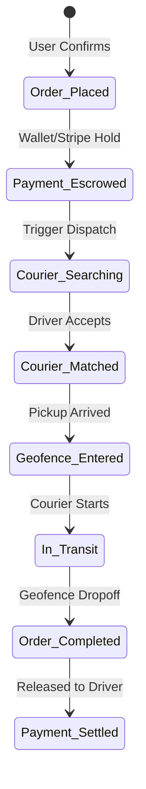

# 🌐 Global Genesis Super App: V4.0 Technical Master Specification

> **Role:** Lead Systems Architect  
> **Objective:** 100-page level technical execution for US, EU, and India markets.  
> **Status:** ARCHITECTURAL SIGN-OFF (RC-3)

---

## 1. Core Infrastructure & Identity (The "Host Shell")

### 1.1. System Design (Mermaid.js)


### 1.2. Identity Strategy: Aadhaar, SSN, and eID
The **Global User Registry** stores only a `user_id` (UUID) and a `sha256(email)` for lookups. Regional ID data is stored in **Regional Shards** using **Envelope Encryption**.

- **India (Aadhaar)**: Stored in an RBI-compliant shard (Mumbai), encrypted with a local DEK. Verified via DigiLocker OIDC.
- **US (SSN)**: Stored in a CCPA/HIPAA-compliant US-East shard. Verified via Plaid/Identifi.
- **EU (eID/Passport)**: Stored in a GDPR-compliant Frankfurt shard. Verified via Veriff/iProov.

### 1.3. API Gateway Routing (Envoy/Kong)
Routing logic is based on the `x-genesis-region` header or JWT claim.
```yaml
# Envoy VirtualHost snippet for regional routing
- name: user-service
  domains: ["api.genesis.app"]
  routes:
    - match: { prefix: "/api/pii", headers: [{ name: "x-genesis-region", exact_match: "IN" }] }
      route: { cluster: user_service_in_cluster }
    - match: { prefix: "/api/pii", headers: [{ name: "x-genesis-region", exact_match: "EU" }] }
      route: { cluster: user_service_eu_cluster }
```

---

## 2. Social Media & E2EE Messaging (Pillar 1)

### 2.1. Social Graph & Data Sharding
- **Graph Database**: Neo4j Aura (Global Cluster) for "Follow/Friend" relationships.
- **Activity Feed**: ScyllaDB for high-throughput (250k+ Ops/sec per node) feed generation.

### 2.2. Messaging: Signal Protocol (E2EE)
Messages are NEVER stored in plaintext. The **Messaging Gateway** only handles **Signal Protocol Envelopes**.
1. **Topic**: `messaging.delivery.{region}`
2. **Schema**: `DoubleRatchetBundle` (Protobuf).

---

## 3. Health & Telemedicine (Pillar 2)

### 3.1. Zero-Knowledge Milestone Sharing
Users want to share "I ran 5 miles" (Health) to "The Feed" (Social).
- **Strategy**: **Scoped Scoped Tokens (SST)**.
- **Logic**: The Health Service issues a cryptographically signed "Milestone Proof" (JWT signed by Health-PK) that contains ONLY the milestone summary, not the raw PHI. The Social Service verifies the signature using the Health Service's public key.

### 3.2. Telemedicine Infra (WebRTC)
- **Signal**: WebSockets on K8s with Redis-backed session affinity.
- **Turn/Stun**: Global relay (Twilio) to bypass Indian carrier-grade NAT.

---

## 4. On-Demand Delivery & Logistics (Pillar 3)

### 4.1. H3 Hexagonal Indexing (Uber Strategy)
Instead of Lat/Long radii, we use **H3 Resolution 7-9** for driver matching.
- **Reason**: Cells have uniform size and neighbors, making "Greedy Matching" O(1) in the cell index.
- **Implementation**: Drivers ping their H3 Cell ID every 5s to Redis.

### 4.2. State Machine: Order Lifecycle


---

## 5. Unified Wallet & Payment Orchestrator (Pillar 4)

### 5.1. Regional Rail Mapping
- **India**: UPI (NPCI) using the `VPA` (Virtual Private Address) rail.
- **EU**: SEPA Inst (Instant Credit Transfer).
- **US**: ACH / Stripe Card Connect.

### 5.2. Double-Entry Ledger Schema
**Table: `ledger_entries`**
| Field | Type | Index |
|---|---|---|
| `entry_id` | UUID | PK |
| `transaction_id` | UUID | FK |
| `account_id` | UUID | FK |
| `entry_type` | Enum(DEBIT, CREDIT) | - |
| `amount` | Decimal(32, 18) | - |
| `currency` | Enum(USD, INR, EUR) | - |
| `region` | Enum(US, EU, IN) | Shard Key |

---

## 6. Cross-App Event Mesh (The "Glue")

### 6.1. Contextual Cross-Selling Workflow
**Use Case**: User posts "I feel sick" → System triggers Health/Delivery nudge.
1. **Producer**: `Social-Sentiment-Worker` detects "Sickness" keywords in a post.
2. **Event**: `social.status.sentiment_flagged` (High Priority).
3. **Consumer**: `Recommendation-Orchestrator` listens.
4. **Action**: 
   - Triggers `Health-Nudge-Notification` (P0 Priority).
   - Pre-fetches `Delivery-Merchant-List` for nearby Pharmacies.
5. **Saga Pattern**: Ensures that if a user books a doctor (Health) and a payment fails (Wallet), the doctor appointment is automatically rolled back via `Health-Compensator-Worker`.

### 6.2. Avro Schema (The Nudge)
```json
{
  "type": "record",
  "name": "NudgeEvent",
  "namespace": "app.genesis.events",
  "fields": [
    { "name": "user_id", "type": "string" },
    { "name": "trigger_source", "type": "string" }, # "SOCIAL_POST"
    { "name": "target_domain", "type": "string" }, # "HEALTH"
    { "name": "metadata", "type": { "type": "map", "values": "string" } }
  ]
}
```

---

## 🚀 Execution Summary
- **Compliance**: HIPAA (US Shard), GDPR (EU Shard), DPDP/RBI (IN Shard) enforced via **Physical DB Partitioning**.
- **Observability**: OpenTelemetry + Jaeger + Prometheus across all regions.
- **Resiliency**: Chaos Mesh deployments in US-East and Mumbai to test regional failovers.

*Document Signed: Genesis Architectural Review Board*
